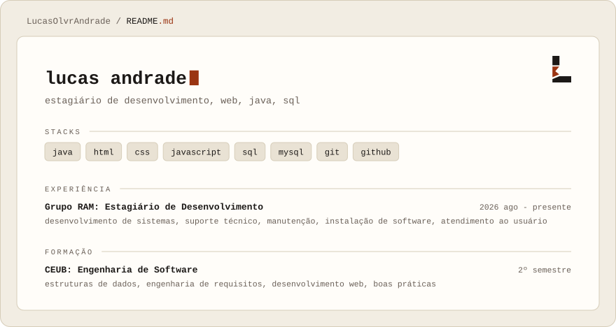

<picture>
  <source media="(prefers-color-scheme: dark)"  srcset="./banner-dark.svg">
  <source media="(prefers-color-scheme: light)" srcset="./banner-light.svg">
  
</picture>

## Projeto em destaque

**[Sistema de barbearia](https://github.com/LucasOlvrAndrade/sistema-barbearia)**, site de agendamento com escolha de barbeiro e painel de gestão para a barbearia: agenda, faturamento, comissões, clientes e folgas.
Veja funcionando: [barbearia.lucas-andrade.dev](https://barbearia.lucas-andrade.dev)

## Objetivo

Evoluir profissionalmente na área de tecnologia, ampliar conhecimentos em desenvolvimento de software e banco de dados, além de construir soluções eficientes que gerem impacto positivo.

## Redes Sociais

